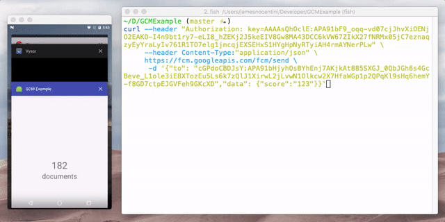
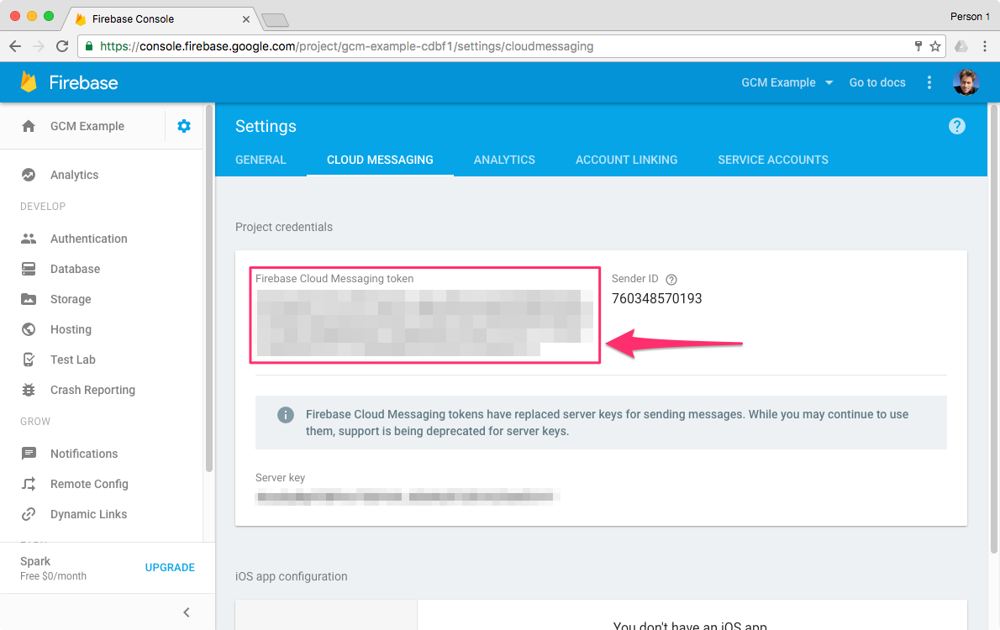
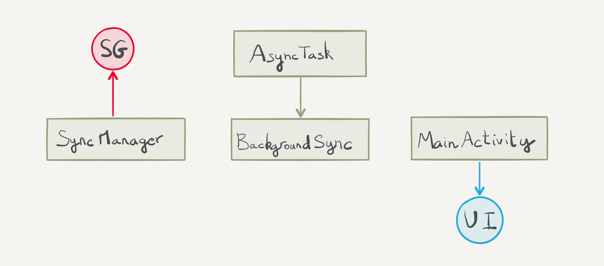
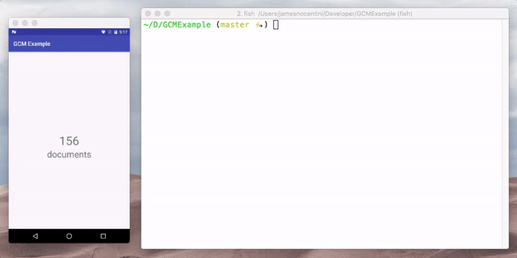

## Background Sync on Android with FCM

When users open your app they expect the data to already be there regardless of whether the connection is up or down. Running replications when the app is in the foreground will ensure that the user receives the latest data after the user opened your app. However it's also possible to schedule one-shot replications while the app is in the background. Background tasks can be scheduled in response to receiving a (silent) push notification for example. This will ensure that your app is always in sync with the server side to provide a great UX regardless of the network connection status. Running a task in the background is largely specific on the OS; in this post, you'll learn how to use Google's push notifications service (FCM) with Couchbase Mobile.

You can check out the accompanying project. You will learn how to send a remote notification from the command line. Upon receiving a remote message, the app starts one-shot push/pull replications as shown below.



### Configure FCM

To use FCM you must register your app to receive notification. You'll need to create a new FCM project (even for the sample project in this post).

1. Create a new Android project.
2. Follow the steps in [this guide](https://firebase.google.com/docs/cloud-messaging/android/client).

**Note:** The app identifier of the sample project is `com.couchbase.gcmexample`.

Once you have an Android Studio project setup with FCM you can follow the next section to send downstream messages.

### Device Token

To send push notifications to a single device you must retrieve the device token. Once you have installed FCM in your project you can retrieve the token with the following.

```java
String token = FirebaseInstanceId.getInstance().getToken();
Log.d(Application.TAG, "Refreshed token: " + token);
```

> **Note:** FCM only works on devices and emulator that have Google Play Services installed.

In a real app, you may store the device token on the user profile document. Each user may be logged into more than one device at a time so we should store each one of them. The user document may have the following structure.

```javascript
{
	"_id": "profile:johnny@couchbase.com",
	...
	"device_tokens": ["APA91K...", "APA91O..."]
}
```

In this blog however, you will retrieve the device token from LogCat.

### First Notification

The simplest way to send a notification to your device is through the GCM HTTP API. The POST request below creates a notification request on the FCM server.

```bash
curl --header "Authorization: key=AUTH_KEY" \
     --header Content-Type:"application/json" \
     https://fcm.googleapis.com/fcm/send \
      -d '{"to": "DEVICE_TOKEN","data": {"mykey":"myvalue"}}'
```

You can retrieve your `AUTH_KEY` from the [Cloud Messaging](https://console.firebase.google.com/project/_/settings/cloudmessaging) tab of the Firebase console.



The `DEVICE_TOKEN` can be found by running the code in the previous section and coying it from LogCat. The way the notification is handled will depend on the state of the application:

- **Foreground:** In this case, the user is already in your application and expects the latest data as soon as available. The simplest way to do that is by running a continuous replication when the app is in the foreground. Hence, when the app is in the foreground, you can dismiss the notification since a continuous replication is already running.
- **Background:** In this case, the app is in the background and so you should have stopped the continuous replication upon entering the background mode. Hence, we'll start a one-shot pull replication to fetch the new data from Sync Gateway.

Let's break down those two different paths of execution into different sections. You can refer to the class diagram below throughout those sections.



### Foreground

When the app enters the foreground you can start a push and pull replication in continous mode. To determine whether the app is in the background we used a utility class called **Foreground** taken from this [open-source gist](https://gist.github.com/steveliles/11116937). This class is used in the `onCreate` method of **Application.java**.

```java
@Override
public void onCreate() {
    super.onCreate();

    final SyncManager syncManager = SyncManager.getSharedInstance(getApplicationContext());

    Foreground foreground = Foreground.init(this);
    foreground.addListener(new Foreground.Listener() {
        @Override
        public void onBecameForeground() {
            Log.d(Application.TAG, "Foreground...");
            syncManager.startPull(true);
            syncManager.startPush();
        }

        @Override
        public void onBecameBackground() {
            Log.d(Application.TAG, "Background...");
            syncManager.stopReplications();
        }
    });
}
```

Then you can display the document count on the UI using a Live Query. The `setupViewAndQuery` method in **MainActivity.java** updates the document count label on the UI. The count increments as documents are added to Sync Gateway through the REST API.



### Notification in the Background

The code below handles the notification and starts an async task (`BackgroundSync`) only when the app is in the background.

```java
public class ExampleMessagingService extends FirebaseMessagingService {
    @Override
    public void onMessageReceived(final RemoteMessage remoteMessage) {
        super.onMessageReceived(remoteMessage);
        Handler handler = new Handler(Looper.getMainLooper());
        handler.postDelayed(new Runnable() {
            @Override
            public void run() {
                Foreground foreground = Foreground.get(getApplicationContext());
                if (foreground.isBackground()) {
                    Log.d(Application.TAG, "From: " + remoteMessage.getFrom());
                    Toast.makeText(getApplicationContext(), "Server ping - sync down!", Toast.LENGTH_LONG).show();

                    BackgroundSync backgroundSync = new BackgroundSync(getApplicationContext());
                    backgroundSync.execute();
                }
            }
        }, 2000);
    }
}
```

The **BackgroundSync** class is a subclass of **AsyncTask** which starts a one-shot pull replication. The code to initialize the Couchbase Lite Manager, Database and Replications is located in **SyncManager.java**.

When the app comes back to the foreground the `onResume` method in **MainActivity.java** gets called which restarts the Live Query in order to update the UI. You can see on the image below that the count is updated accordingly. The network is disabled to show that it doesn't matter anymore if the device is disconnected when coming into the foreground because the documents were already pulled.


### App Server for Notifications

To send the notification when a certain event happens you could either use the Changes Feed API or Webhooks. Refer to [the documentation](http://developer.couchbase.com/documentation/mobile/current/guides/sync-gateway/server-integration/index.html) to learn how to use each one.

### Wrap up

Using Firebase Cloud Messaging to trigger data fetching from the server side can provide a great user experience without any additional battery and network usage overhead.

More reading about FCM:

- Setup FCM on Android: [https://firebase.google.com/docs/cloud-messaging/android/client](https://firebase.google.com/docs/cloud-messaging/android/client)
- Processes and Application Life Cycle: [https://developer.android.com/guide/topics/processes/process-lifecycle.html](https://developer.android.com/guide/topics/processes/process-lifecycle.html)
- Android background processing: [http://www.vogella.com/tutorials/AndroidBackgroundProcessing/article.html](http://www.vogella.com/tutorials/AndroidBackgroundProcessing/article.html)
- Android Threading & Background Tasks: [https://realm.io/news/android-threading-background-tasks/](https://realm.io/news/android-threading-background-tasks/)

More reading about GCM:

- Tips on setting up GCM in your app: [https://blog.pushbullet.com/2014/02/12/keeping-google-cloud-messaging-for-android-working-reliably-techincal-post/](https://blog.pushbullet.com/2014/02/12/keeping-google-cloud-messaging-for-android-working-reliably-techincal-post/)
- The Death of the Refresh button: [https://www.youtube.com/watch?v=Dvshiz9pbUc](https://www.youtube.com/watch?v=Dvshiz9pbUc)
- Data sync in the Google I/O app: [http://android-developers.blogspot.co.uk/2014/09/conference-data-sync-gcm-google-io.html](http://android-developers.blogspot.co.uk/2014/09/conference-data-sync-gcm-google-io.html)