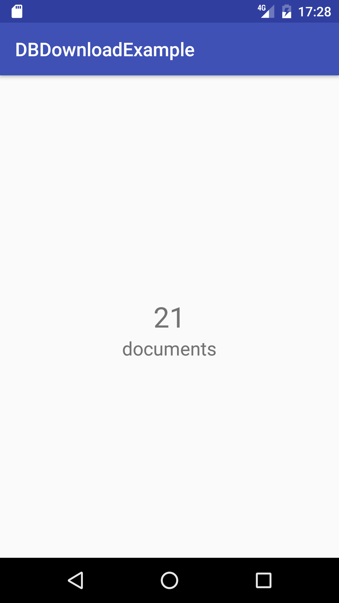

## Downloading Database

This example shows you how to download a Couchbase Lite database and then display the total number of documents it contains on the screen. You can run the accompanying project in the root of this folder. Once you open it in Android Studio and run the project you should see the following.



### File Download

You will use the `AsyncTask` class on Android to download the database file. The snippet below downloads the database to a file named **todo.cblite2.zip** in the files directory. Then the Couchbase Lite `ZipUtils.unzip` class method unzips the file in the same directory.

```java
public class DatabaseDownloader extends AsyncTask {

    private String stringURL = "https://cl.ly/3W0l0R1G0P11/todo.cblite2.zip";
    private Context context;
    private DownloaderListener downloaderListener;

    @Override
    protected Object doInBackground(Object[] params) {

        int count;
        try {
            URL url = new URL(stringURL);
            URLConnection conection = url.openConnection();
            conection.connect();

            // Download the file
            InputStream input = new BufferedInputStream(url.openStream(), 8192);

            // Output stream
            File dataDir = getDataFolder(context);
            File dataFile = new File(dataDir, "todo.cblite2.zip");
            OutputStream output = new FileOutputStream(dataFile);

            byte data[] = new byte[1024];

            while ((count = input.read(data)) != -1) {
                output.write(data, 0, count);
            }

            // flushing output
            output.flush();

            // closing streams
            output.close();
            input.close();

            ZipUtils.unzip(new FileInputStream(dataFile), this.context.getFilesDir());

        } catch (Exception e) {
            Log.e("Error: ", e.getMessage());
        }

        downloaderListener.onCompleted();

        return null;
    }

}
```

The database named `todo.cblite2` can now be read. To notify your application when the download task is completed you can implement your own interface called **DownloaderListener.java** (this follows the observer pattern). You can open the database and query it once the `onCompleted` method is called.

```java
DatabaseDownloader databaseDownloader = new DatabaseDownloader(getApplicationContext());
databaseDownloader.execute();
databaseDownloader.setDownloaderListener(new DownloaderListener() {
    @Override
    public void onCompleted() {
        setupQuery();
    }
});
```

The `setupQuery` method opens the database called "todo" and displays the total document count on a `TextView`.

```java
private void setupQuery() {
    Database database = null;
    try {
        database = manager.getExistingDatabase("todo");
    } catch (CouchbaseLiteException e) {
        e.printStackTrace();
    }
    if (database != null) {
        LiveQuery liveQuery = database.createAllDocumentsQuery().toLiveQuery();
        liveQuery.addChangeListener(new LiveQuery.ChangeListener() {
            @Override
            public void changed(final LiveQuery.ChangeEvent event) {
                runOnUiThread(new Runnable() {
                    @Override
                    public void run() {
                        docCountLabel.setText(String.valueOf(event.getRows().getCount()));
                    }
                });
            }
        });
        liveQuery.start();
    }
}
```