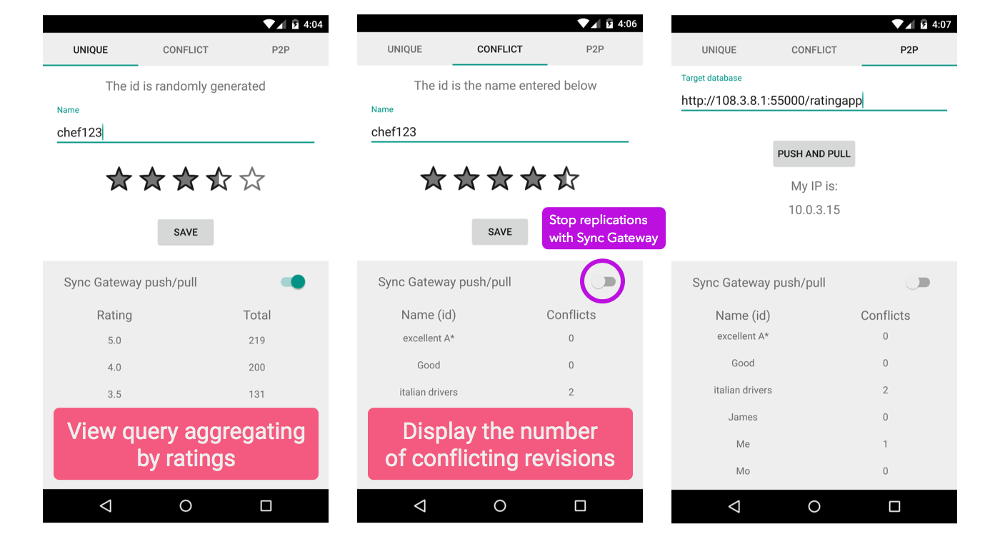
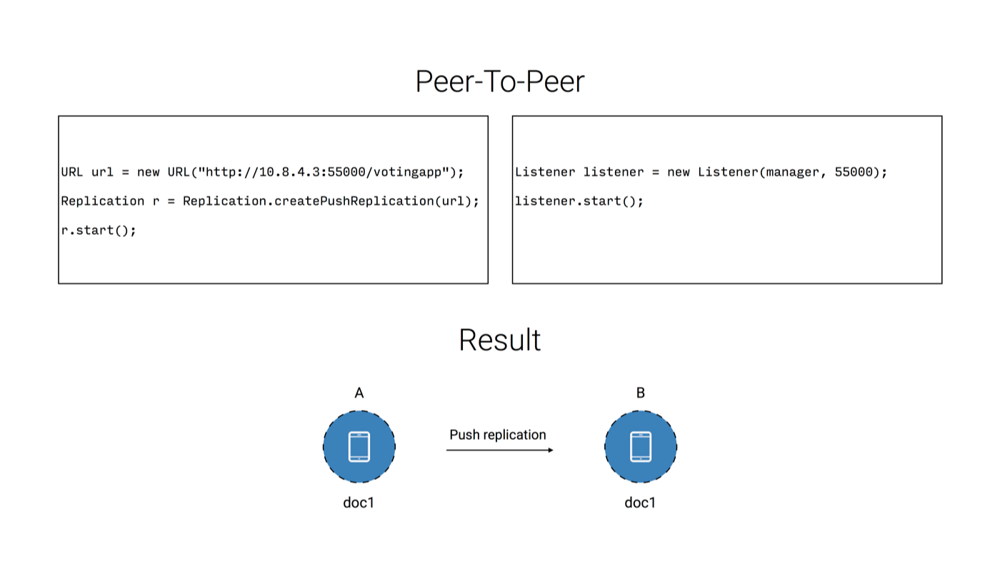

# How to use Sync Gateway and Peer-to-Peer sync in an Android application

This example is a simple Android application in which the user can save a review with a rating and name property to a Couchbase Lite database. It uses the TabLayout and ViewPager components to illustrate 3 different scenarios, each one being in a separate tab:



**Unique (1st tab):** The **_id** field is randomly generated by Couchbase Lite. A new document is persisted to the database every time the **Save** button is pressed. The document stored will have the following properties:

```javascript
{
	"_id": "008c30d0-0f57-4477-8fa5-b9685f410f9e",
	"_rev": "1-38fd691714c1ed19ce48a1f4a87c20d9",
	"name": "chef123",
	"rating": 4,
	"type": "unique"
}
```

**Conflict (2nd tab):** The **_id** field is set to whatever the user entered in the text input. Pressing **Save** will persist a new document to the database or update it if one already exists with this ID.

```javascript
{
	"_id": "chef123",
	"_rev": "1-38fd691714c1ed19ce48a1f4a87c20d9",
	"rating": 4,
	"type": "conflict"
}
```

**P2P (3rd tab):** The text input field takes the URL of a target Couchbase Lite or Sync Gateway database of the form `http://{ip}:55000/ratingapp`.



Below the ViewPager, there is a **Switch** toggle button to start/stop the continuous pull/push replications to another remote database. This would usually be the URL of the Sync Gateway running on the cloud. You can change the remote URL in `StorageManager.java` to your own Sync Gateway instance (see section below to deploy Couchbase Server and Sync Gateway).

Finally, there is a table on the bottom half of the screen that displays the following:

- On the 1st tab, it shows the number of reviews for each possible value. Under the hood, it's using a query with a group level set to 1 to aggregate the document with the same rating and a reduce function to count them.
- On the 2nd and 3rd tab, it displays the number of conflicting revisions of a document. It only shows the number of conflicting revisions but it would also be possible to resolve the conflicts by using the `database.getDocument({id}).getConflictingRevisions()` method.

## Deploying Sync Gateway and Couchbase Server

Deploy a fresh Sync Gateway and Couchbase Server instance for this application with Tutum. Log on or create a new account on [Tutum.co](http://tutum.co), then link it to your PaaS account (Digital Ocean, AWS...). On the **Nodes** tab, create a new node and choose the PaaS of your choice. In the **tag** field, add **rating-app**.

Next, select the **Stacks** tab with this [Tutum file](http://github.com/couchbaselabs/mini-hacks/tree/master/android-rating-app/tutum.yml) and click create. This stack includes a Sync Gateway container linked with a Couchbase Server container.

**NOTE:** The Sync Gateway container will fail to run because it's trying to connect to a Couchbase Server bucket that doesn't exist. It may take several minutes for Couchbase Server to be deployed and for the admin console to be reachable on `http://{ip}:8091`. Once it's reachable, create an account and a bucket called **default** (the Sync Gateway configuration file expects the bucket to be named **default**). Once the bucket is created, head back to the Tutum **Services** tab and restart the Sync Gateway container (or just click the **Run** button as it should be stopped).

## Removing all documents from a database

Use the [delete-documents/delete.js](http://github.com/couchbaselabs/mini-hacks/tree/master/android-rating-app/delete-documents/delete.js) script to remove all documents in a particular database. It could be a Couchbase Lite or Sync Gateway database. Replace the hostname in the script with the one of the target database you wish to delete the documents from.