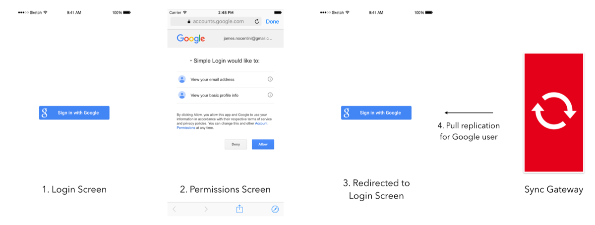
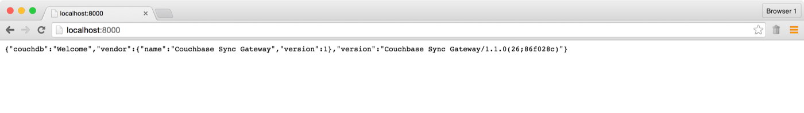
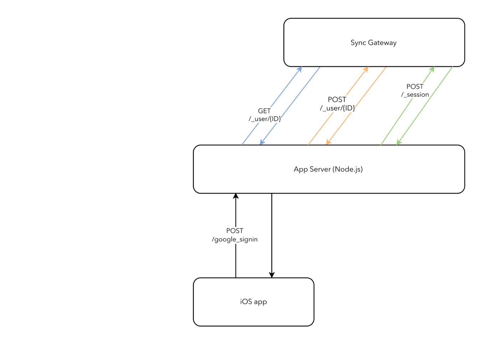
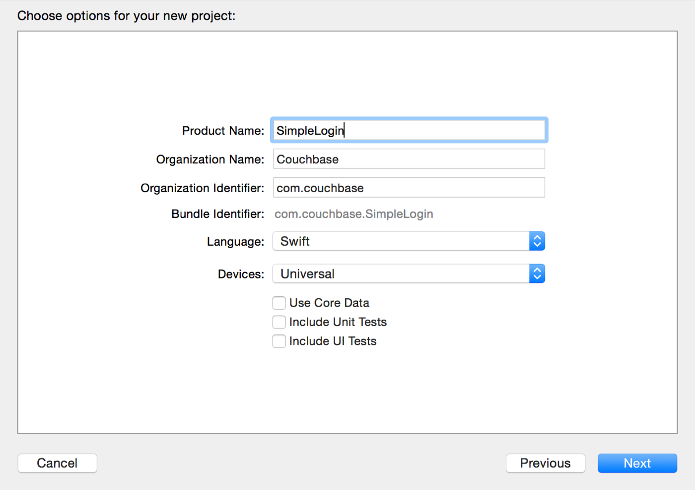
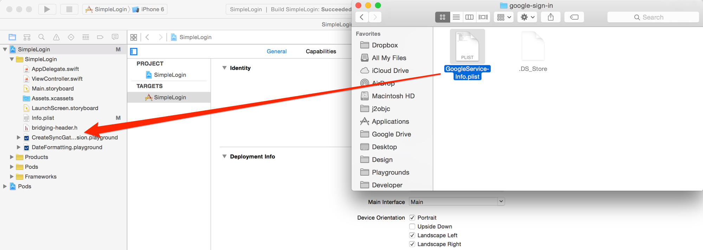
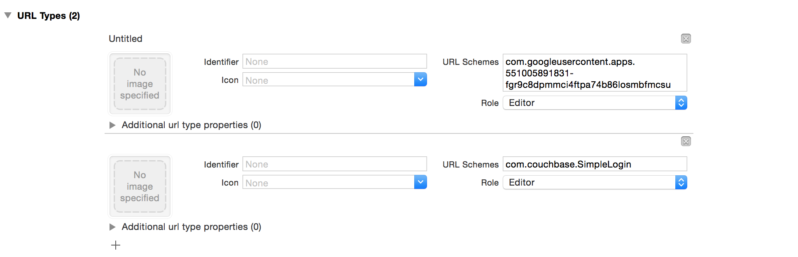
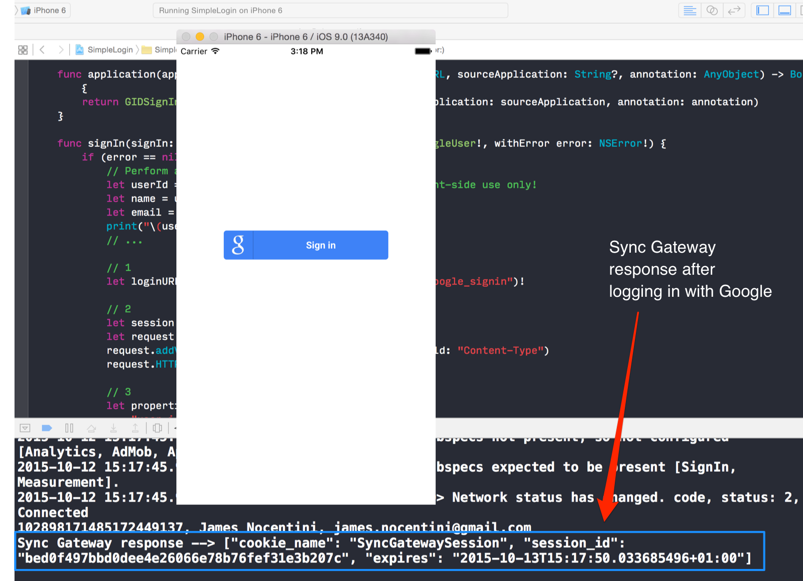
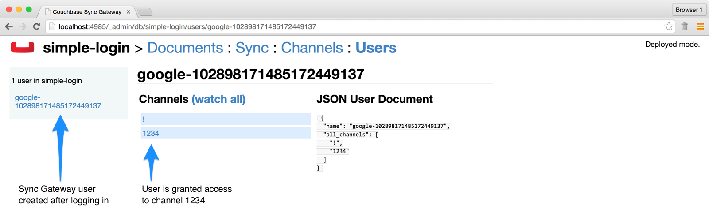

# Adding Google Sign-In with Node.js to a Couchbase Mobile application

Using OAuth APIs provided by 3rd party applications such as Google+ to login in your mobile app can provide a delightful first time experience to users. They can login with an account that they already know and trust and populate their profile with data that they entered on Google+. In this tutorial, you'll learn how to:

- Write a Node.js app to handle the authentication with Sync Gateway.
- Use the Couchbase Sync Gateway Admin REST API to create users and sessions.
- Integrate Google Sign-In to an iOS app written with Swift 2.
- Build a simple iOS app in Swift to test the new login endpoint and replicate a few documents.

The final project can be found on [GitHub](https://github.com/couchbaselabs/mini-hacks/tree/master/google-sign-in).



## Prerequisites

The prerequisites for this tutorial are:

- Node.js
- Xcode 7+ (you will use Swift 2 to build the sample app)

## Getting Started

Download Sync Gateway from the link below and unzip the file:

> http://www.couchbase.com/nosql-databases/downloads

In a new file named **sync-gateway-config.json**, paste in the following:

```javascript
{
  "log": ["*"],
  "databases": {
    "simple-login": {
      "server": "walrus:",
      "users": { "GUEST": { "disabled": true } },
      "sync": `
        function(doc, oldDoc) {
          channel(doc._id);
          access(doc.user_id, doc._id);
        }
      `
    }
  }
}
```

In this config file, you're creating a database called **simple-login** and using the Sync Function to map each document to a different channel and grant a user access to the channel (the user name being stored in the `user_id` field of the document). 

Start Sync Gateway with the following command:

```bash
$ ~/Downloads/couchbase-sync-gateway/bin/sync_gateway sync-gateway-config.json
```

## Reverse Proxy for Sync Gateway

With Sync Gateway running, you get to shift your focus to building the App Server to handle authentication between Google and Sync Gateway.

You'll use the popular [Express](http://expressjs.com/) module to handle the request to create a user and the [request](https://github.com/request/request) module to proxy all other traffic to Sync Gateway.

Install the following Node.js modules:

```bash
$ npm install express body-parser request --save
```

Create a new file called **server.js** and add the following:

```javascript
// 1
var express = require('express')
  , bodyParser = require('body-parser')
  , request = request('request').defaults({json: true});

// 2
var app = express();
app.use('/google_signin', bodyParser.json());

app.post('/google_signin', function (req, res) {
  // TODO: handle login request
});

// 3
app.all('*', function (req, res) {
  var url = 'http://0.0.0.0:4984' + req.url;
  req.pipe(request(url)).pipe(res);
});

// 4
var server = app.listen(8000, function () {
  var host = server.address().address;
  var port = server.address().port;

  console.log('App listening at http://%s:%s', host, port);
});
```

Here are the different things happening:

1. Require the Node.js module you installed previously.
2. Instantiate a new instance of express and use the **bodyParser** middleware only for the **/google_signin** endpoint.
3. Proxy all other requests to Sync Gateway.
4. Start the Node.js web server on port 8000.

Start the server with `$ node server.js` and open `http://localhost:8000` in your browser. You should see the Sync Gateway welcome message:



### From Google SignIn to Sync Gateway Sessions

With the reverse proxy in place you can now add some code to handle the Google SignIn request and return the session credentials:



A few things are happening on this diagram:

- **Black** sends the Google user ID to the App Server.
- **Blue** checks if a user exists in Sync Gateway with that user ID.
- **Orange** creates the user if it doesn't already exist (typically the first time the user logs in with Google in your app).
- **Green** creates a session, the response will contain session credentials that can be passed to the client iOS app for push/pull replications. All of the Couchbase Lite SDKs have a method to specify session credentials to be used in push/pull replications.

In the **/google_signin** handler, add the following:

```javascript
/** URL of the Sync Gateway instance running locally */
var stringURL = 'http://0.0.0.0:4985/simple-login';

/** Given the name of a user that exists in Sync Gateway, create a new session */
var sessionRequest = function (name, callback) {
return request({
  method: 'POST',
  url: stringURL + '/_session',
  json: true,
  body: {
    name: name
  }
}, callback);
};

var json = req.body;
var name = json.auth_provider + '-' + json.user_id.toString();
request
/** Check if the user already exists */
.get(stringURL + '/_user/' + name)
.on('response', function (userExistsResponse) {
  if (userExistsResponse.statusCode === 404) {
    /** If the user doesn't exist, create one with the Google user ID as the name */
    return request
      .put({
        url: stringURL + '/_user/' + name,
        json: true,
        body: {
          name: name,
          password: Math.random.toString(36).substr(2)
        }
      })
      .on('response', function (createUserResponse) {
        if (createUserResponse.statusCode === 201) {
          /** If the user was created successfully, create the session */
          sessionRequest(name, function (sessionError, sessionResponse, body) {
            res.send(body);
          });
        }
      });
  }
  /** The user already exists, simply create a new session */
  sessionRequest(name, function (sessionError, sessionResponse, body) {
    res.send(body);
  });
});
```

Restart the Node.js application and run the following curl request to sign up a new user:

```bash
$ curl -vX POST \
			-H 'Content-Type: application/json' \
			http://localhost:8000/google_signin \
			-d '{"user_id": "123", "auth_provider": "google"}'

// Response			
{
	"session_id":"8520c19159a4154abf5fb9b9003ff9677e035929",
	"expires":"2015-10-13T12:48:05.879325313+01:00",
	"cookie_name":"SyncGatewaySession"
}
```


In the next section, you will create a simple a iOS app with Swift 2 to use the new functionality of your App Server.

## Swift Time: Simple Login Screen for iOS

Switch to Xcode and create a new project with the **Single View Application** template:



We'll use Cocoapods to install dependencies in this project. Close the Xcode project and from the command line run `$ pod init` to migrate your project to using Cocoapods. Open the **Podfile** and add the statements:

```
pod 'Google/SignIn'
pod 'couchbase-lite-ios'
```

Run `$ pod install` and open the **SimpleLogin.xcworkspace** file that was generated. Next, you will add a bridging header to access the Google SignIn and CouchbaseLite SDKs that use Objective-C from your Swift code. In the Xcode project navigator, right-click on SimpleLogin and select **New File...**. Choose the Header File template and call it **bridging-header.h**. Add the following import statements:

```objective-c
#import <Google/SignIn.h>
#import <CouchbaseLite/CouchbaseLite.h>
```

Now you need to tell Xcode to use this file. In the **SimpleLogin** target, select the **Build Settings** tab and scroll down to the **Objective-C Bridging Header**. Add this filepath:

> SimpleLogin/bridging-header.h

### Google Sign-In Configuration file

Before you can use the Sign-In SDK in your app, you'll need to create a new project in the Google Developer Console and generate a client ID. Luckily for us, this can be done automatically with the following link:

> https://developers.google.com/mobile/add?platform=ios&cntapi=signin&cntapp=Simple%20Login&cntpkg=com.couchbase.SimpleLogin

On the page above, click the **Choose and configure services** button and you'll be taken to a new page where you can enable **Google Sign-In**. From there, click **Generate configuration files** and download the new plist file.

Import **GoogleServer-Info.plist** to your Xcode project:



### Adding URL schemes to your project

Google Sign-In requires two custom URL Schemes to be added to your project. To add the custom schemes:

1. Open your project configuration: double-click the project name in the left tree view. Select your app from the **TARGETS** section, then select the **Info** tab, and expand the **URL Types** section.
2. Click the **+** button, and add a URL scheme for your reversed client ID. To find this value, open the `GoogleService-Info.plist` configuration file, and look for the `REVERSED_CLIENT_ID` key. Copy the value of that key, and paste it into the **URL Schemes** box on the configuration page. Leave the other fields blank.
3. Click the **+** button, and add a second URL scheme. This one is the same as your app's bundle ID. In this case, it should be **com.couchbase.SimpleLogin**.

When completed, your config should look something similar to the following (but with your application-specific values):



### Integrating Google Sign-In into your iOS app

Now your project is configured correctly you can start using the SDK to add the Login button on the UI and app logic to retrieve the user info. In **AppDelegate.swift**, declare that this class implements the `GIDSignInDelegate` and add the following in the `application:didFinishLaunchingWithOptions:` method:

```swift
func application(application: UIApplication,
  didFinishLaunchingWithOptions launchOptions: [NSObject: AnyObject]?) -> Bool {
    // Initialize sign-in
    var configureError: NSError?
    GGLContext.sharedInstance().configureWithError(&configureError)
    assert(configureError == nil, "Error configuring Google services: \(configureError)")

    GIDSignIn.sharedInstance().delegate = self

    return true
}
```

Next, implement the `application:openURL:` method of your app delegate. The method should call the `handleURL` method of the `GIDSignIn` instance, which will properly handle the URL that your application receives at the end of the authentication process:

```swift
func application(application: UIApplication,
  openURL url: NSURL, sourceApplication: String?, annotation: AnyObject?) -> Bool {
    return GIDSignIn.sharedInstance().handleURL(url,
        sourceApplication: sourceApplication,
        annotation: annotation)
}
```

In the app delegate, implement the `GIDSignInDelegate` protocol to handle the sign-in process by defining the following methods:

```swift
func signIn(signIn: GIDSignIn!, didSignInForUser user: GIDGoogleUser!,
  withError error: NSError!) {
    if (error == nil) {
      // Perform any operations on signed in user here.
      let userId = user.userID                  // For client-side use only!
      let idToken = user.authentication.idToken // Safe to send to the server
      let name = user.profile.name
      let email = user.profile.email
      // ...
    } else {
      println("\(error.localizedDescription)")
    }
}
```

### Adding the Sign-In Button

Next, you will add the Google Sign-In button so that the user can initiate the sign-in process. In the view controller that manages your app's sign-in screen, make the class implement the `GIDSignInUIDelegate` protocol.

In the view controller, override the viewDidLoad method to set the UI delegate of the GIDSignIn object, and (optionally) to sign in silently when possible.

```swift
override func viewDidLoad() {
  super.viewDidLoad()

  GIDSignIn.sharedInstance().uiDelegate = self

  // Uncomment to automatically sign in the user.
  //GIDSignIn.sharedInstance().signInSilently()

  // TODO(developer) Configure the sign-in button look/feel
  // ...
}
```

Implement the `GIDSignInUIDelegate` protocol:

```swift
// Implement these methods only if the GIDSignInUIDelegate is not a subclass of
// UIViewController.

// Stop the UIActivityIndicatorView animation that was started when the user
// pressed the Sign In button
func signInWillDispatch(signIn: GIDSignIn!, error: NSError!) {
  myActivityIndicator.stopAnimating()
}

// Present a view that prompts the user to sign in with Google
func signIn(signIn: GIDSignIn!,
    presentViewController viewController: UIViewController!) {
  self.presentViewController(viewController, animated: true, completion: nil)
}

// Dismiss the "Sign in with Google" view
func signIn(signIn: GIDSignIn!,
    dismissViewController viewController: UIViewController!) {
  self.dismissViewControllerAnimated(true, completion: nil)
}
```

Add a `GIDSignInButton` to your storyboard, XIB file, or instantiate it programmatically. To add the button to your storyboard or XIB file, add a View and set its custom class to `GIDSignInButton`.

Run the app and you should now see the Google styled button and be able to login:


### Creating a Session with Sync Gateway

In **AppDelegate.swift**, find the `signIndidSignInForUserwithError` method and add the following below the existing code:

```swift
// 1
let loginURL = NSURL(string: "http://localhost:8000/google_signin")!

// 2
let session = NSURLSession.sharedSession()
let request = NSMutableURLRequest(URL: loginURL)
request.addValue("application/json", forHTTPHeaderField: "Content-Type")
request.HTTPMethod = "POST"

// 3
var properties = [
    "user_id": userId,
    "auth_provider": "google"
]
let data = try! NSJSONSerialization.dataWithJSONObject(properties, options: NSJSONWritingOptions.PrettyPrinted)

// 4
let uploadTask = session.uploadTaskWithRequest(request, fromData: data, completionHandler: { (data, response, error) -> Void in
    // 5
    let json = try! NSJSONSerialization.JSONObjectWithData(data!, options: NSJSONReadingOptions.AllowFragments) as! Dictionary<String, AnyObject>
    print("\(json)")
    
    // TODO: pull/push replications with authenticated user
    
})
uploadTask.resume()
```

Here's what is happening above:

1. The login URL on the App Server running locally.
2. Create a request instance.
3. Serialize the properties containing the Google userID as JSON to be sent in the request.
4. Send POST request.
5. Response object containing Sync Gateway Session credentials

**NOTE:** Before running the application, be sure the disable App Transport security since the App Server isn't using HTTPS. Open **Info.plist** and add the following:

```xml
<key>NSAppTransportSecurity</key>
<dict>
<key>NSAllowsArbitraryLoads</key><true/>
</dict>
```

Build and run. Notice the response from the App Server in the Xcode debugger:



Finally, you will add the Couchbase code to start a pull replication with the session details. In **AppDelegate.m**, add the method `startReplications`:

```swift
func startReplications(sessionInfo: Dictionary<String, String>) {
    // 1
    let dateString = sessionInfo["expires"]!
    let dateFormatter = NSDateFormatter()
    dateFormatter.dateFormat = "yyyy-MM-dd'T'HH:mm:ss.SSSZ"
    let date = dateFormatter.dateFromString(dateString)!
    
    // 2
    let manager = CBLManager.sharedInstance();
    let database = try! manager.databaseNamed("simple-login")
    
    // 3
    let syncGatewayURL = NSURL(string: "http://localhost:8000/simple-login")!
    let pull = database.createPullReplication(syncGatewayURL)
    pull?.continuous = true
    
    // 4
    pull?.setCookieNamed(sessionInfo["cookie_name"]!, withValue: sessionInfo["session_id"]!, path: "/", expirationDate: date, secure: false)
    pull?.start()
}
```

Call this method in the callback of the uploadTask you added in the previous step.

Et voilà! You now have a pull replication running for the user with name `google-{userID}`. You can test the access is working by adding a document with the following command (replace the Google user ID with that of a user already logged in):

```bash
$ curl -vX POST \
		-H 'Content-Type: application/json' \
		http://localhost:4985/simple-login/ \
		-d '{"_id": "1234", "user_id": "google-102898171485172449137"}'
```

Head over to the Users tab in the Admin UI at [http://localhost:4985/_admin/db/simple-login/users](http://localhost:4985/_admin/db/simple-login/users) and notice that user `google-102898171485172449137` now has access to channel `1234`:



## Where to Go From Here

Congratulations! You learnt how to use Google SignIn with Couchbase Mobile to create a delightful experience and synchronize documents per the user ID of the logged in user.

Feel free to share your feedback, findings or ask any questions in the comments below or in the forums. Talk to you soon!

