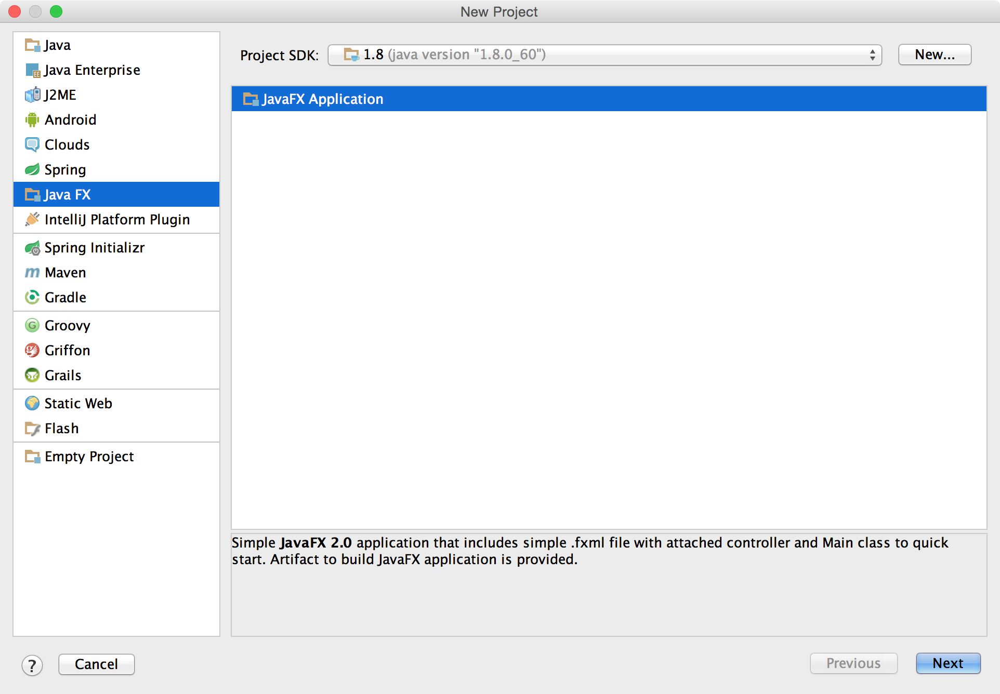
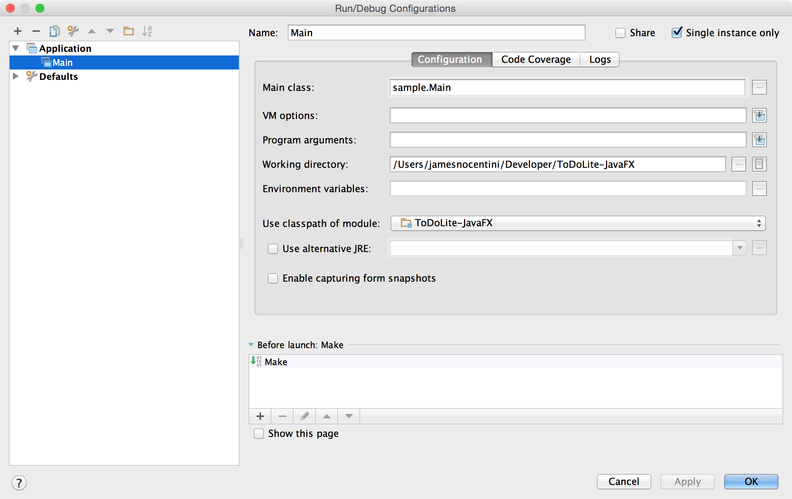
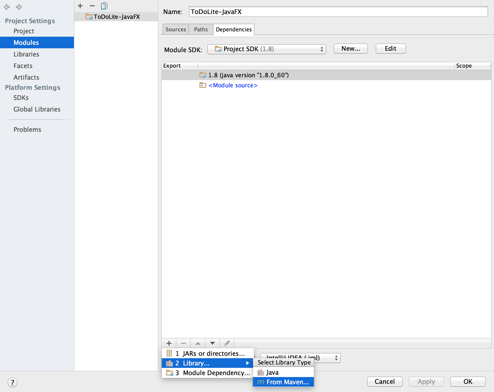
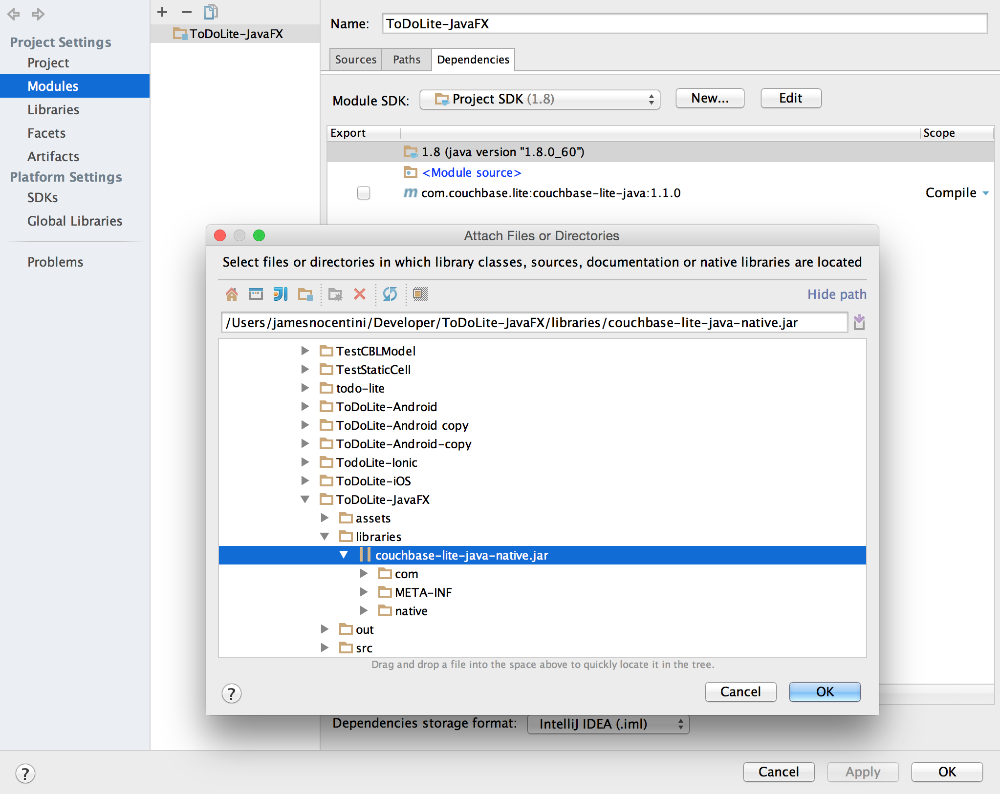
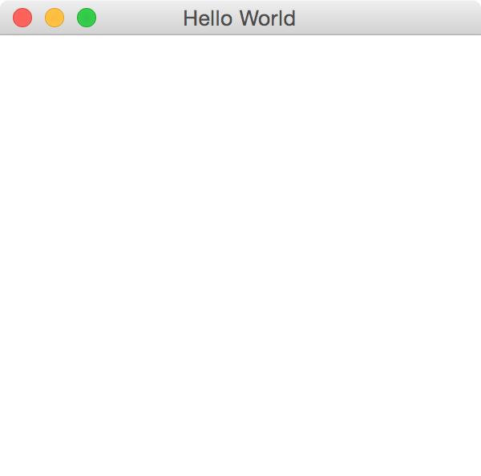
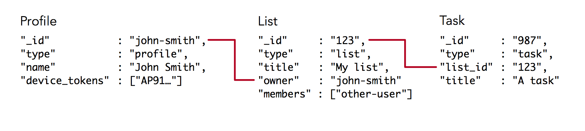

# Implement Facebook Login a JavaFX application

To authenticate users on Sync Gateway, you can use basic authentication, custom authentication. There is built-in support for Facebook in Sync Gateway which makes it very easy to start replicating documents between users.

The Java application can pass arbitratry scripts to the JavaScript engine of a `WebEngine` object by callend the `WebEngine.executeScript()` method.

## Getting started

Open IntelliJ IDEA and choose the **Create New Project** menu. On the left pane, select the **JavaFX** application template and set the Project SDK to 1.8.



Name the application **ToDoLite-JavaFX** and click Finish, this will open your newly created project in a new window. Before we begin writing code, there a couple configuration settings to change. Select the **Edit Configurations...** menu in the top right corner which will open a new window. Check the **Single instance only** box to ensure that the IDE doesn't start a new instance of the application every time you click the Run button.



With that, let's turn our attention to adding Couchbase Lite as a dependency to the project. Couchbase Lite is


Select **File\Project Structure...** from the top menu bar, a new window will open and on the **Modules** tab, add a new Library from Maven:



In the search field, type **com.couchbase.lite:couchbase-lite-java:1.1.0** and click **OK**. This will download the library and add it to the project. Next, you will add a JAR file that contains the native library for the platform you're running the application on. For OS X users, download this JAR file and add it in a new directory called **libraries** in your project. Return the **Modules** window and add this JAR file from the **Add** menu:



Click **OK** and run the application by click the **Run** button in the top right corner. You should see a blank window with the message **Hello World** in the status bar:



## Building the UI

## Adding Sync

In this simple case, you'll use Basic Authentication and hard code the user's login credentials in the configuration file like so:

```javascript
...
      "users": {
        "GUEST": {"disabled": true},
        "wayne": {"password": "letmein"}
      },
...
```

Download Sync Gateway for the platform you're running on from here:

> http://www.couchbase.com/nosql-databases/downloads#Couchbase\_Mobile

In your project directory, create a new file called sync-gateway-config.json and paste the following:

```
{
  "log": ["CRUD", "REST+", "Access"],
  "facebook": {"register": true},
  "databases": {
    "todos": {
      "server": "walrus:",
      "users": {
        "GUEST": {"disabled": true},
        "wayne": {"password": "letmein"}
      },
      "sync":`
        function (doc, oldDoc) {
            // NOTE this function is the same across the iOS, Android, and PhoneGap versions.
            if (doc.type == "task") {
                if (!doc.list_id) {
                    throw({forbidden: "Items must have a list_id"})
                }
                channel("list-" + doc.list_id);
            } else if (doc.type == "list") {
                channel("list-" + doc._id);
                if (!doc.owner) {
                    throw({forbidden: "List must have an owner"})
                }
                if (oldDoc) {
                    var oldOwnerName = oldDoc.owner.substring(oldDoc.owner.indexOf(":") + 1);
                    requireUser(oldOwnerName)
                }
                var ownerName = doc.owner.substring(doc.owner.indexOf(":") + 1);
                access(ownerName, "list-" + doc._id);
                if (Array.isArray(doc.members)) {
                    var memberNames = [];
                    for (var i = doc.members.length - 1; i >= 0; i--) {
                        memberNames.push(doc.members[i].substring(doc.members[i].indexOf(":") + 1))
                    }
                    ;
                    access(memberNames, "list-" + doc._id);
                }
            } else if (doc.type == "profile") {
                channel("profiles");
                var user = doc._id.substring(doc._id.indexOf(":") + 1);

                if (user !== doc.user_id) {
                    throw({forbidden: "Profile user_id must match docid : " + user + " : " + doc.user_id})
                }
                requireUser(user);
                access(user, "profiles"); // TODO this should use roles
            }
        }
      `
    }
  }
}
```

Start Sync Gateway with the config file you just created:

```bash
$ ~/Downloads/couchbase-sync-gateway/bin/sync_gateway /path/to/project/sync-gateway-config.json
```

## Model classes

The data model is the following:



With JavaFX it's common to use **Properties** for all fields of a model class. A **Property** allows us, for example, to automatically be notified when the **title** or any other variable is changed. This helps us keep the view in sync with the data.